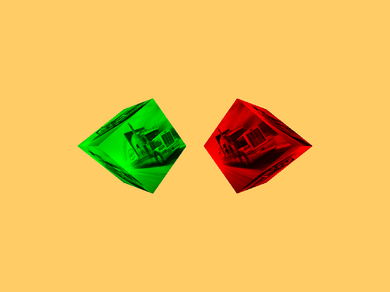
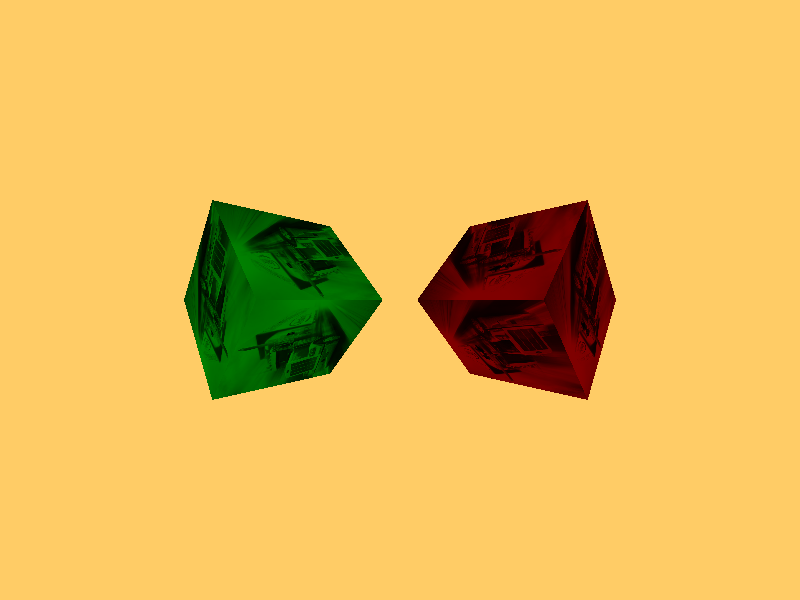
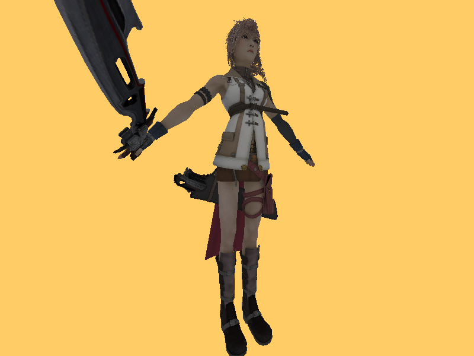
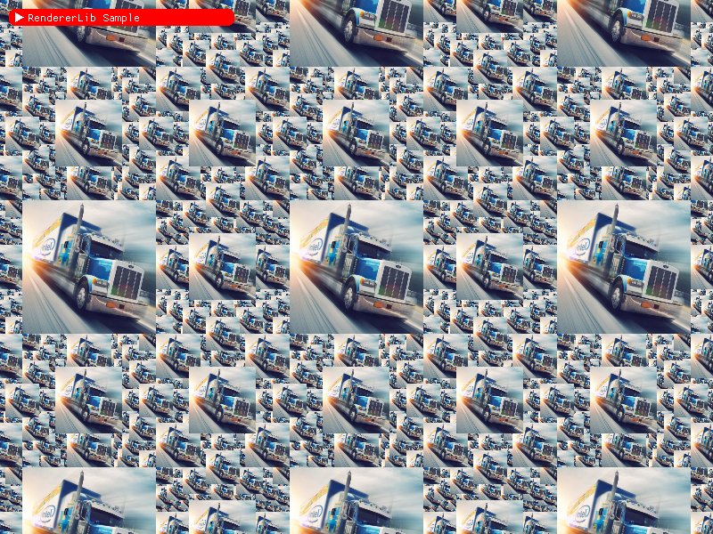

Ashes
=====
Ashes is a drop-in replacement to Vulkan.  
It allows to write Vulkan code, and to select the rendering API that will be used.  
  
It is still a WIP, the library is far from complete!!  
  
To build it, you can use CMake.

## Renderers available

- Vulkan: Ashes is a passthrough, when using Vulkan rendering API, and it has no additional cost if dynamic loader is used.
- OpenGL 3.X
- OpenGL 4.X
- Direct3D 11.

## How to use it

Two workflows are possible:

### Automatic mode

You load Ashes' shared library instead of Vulkan's, and you're done.  
The API selection will be done on first call of `vkGetInstanceProcAddr` (for dynamic loader), or on first Vulkan API call (for static loader).  
  
With this mode, the only change you have to make is the dynamic library's name (ashes.so.1/ashes-1.dll instead of libvulkan.so.1/vulkan-1.dll).

### Manual mode

You can ask for the list of loaded plugins, through a call to the function `int ashEnumeratePlugins( uint32_t * count , AshPluginDescription * plugins );`.  
It works as Vulkan ones : if `plugins` is set to `NULL`, `count` will then contain the number of loaded plugins.  

### API

The following API is available, in `ashes.h`:  

```c
typedef struct AshPluginFeatures
{
	// Whether or not the plugin supports buffer ranges.
	VkBool32 hasBufferRange;
	// Whether or not the plugin supports image textures.
	VkBool32 hasImageTexture;
	// Whether or not the plugin supports vertex base instance.
	VkBool32 hasBaseInstance;
	// Whether or not the plugin supports clearing of single images.
	VkBool32 hasClearTexImage;
	// Whether or not the plugin supports compute shaders.
	VkBool32 hasComputeShaders;
	// Whether or not the plugin supports shader storage buffers.
	VkBool32 hasStorageBuffers;
} AshPluginFeatures;

typedef struct AshPluginSupport
{
	// The plugin's priority (from 1 (low) to 10 (high)).
	uint32_t priority;
	// Whether or not the plugin is supported.
	VkBool32 supported;
} AshPluginSupport;

typedef struct AshPluginDescription
{
	//The plugin's short name.
	char name[16];
	//The plugin's description.
	char description[64];
	//The plugin's main entry point.
	PFN_vkGetInstanceProcAddr getInstanceProcAddr;
	//The plugin's supported features.
	AshPluginFeatures features;
	//The plugin's static functions (for static loader support).
	AshPluginStaticFunction functions;
	//The plugin's support informations.
	AshPluginSupport support;
} AshPluginDescription;

// Enumerates the available rendering APIs.
typedef void( VKAPI_PTR * PFN_ashEnumeratePluginsDescriptions )( uint32_t *, AshPluginDescription * );
Ashes_API void VKAPI_PTR ashEnumeratePluginsDescriptions( uint32_t * count
	, AshPluginDescription * pDescriptions );

// Defines the active rendering API.
typedef VkResult( VKAPI_PTR * PFN_ashSelectPlugin )( AshPluginDescription );
Ashes_API VkResult VKAPI_PTR ashSelectPlugin( AshPluginDescription description );

// Retrieves the active rendering API informations.
typedef VkResult( VKAPI_PTR * PFN_ashGetPluginDescription )( AshPluginDescription * );
Ashes_API VkResult VKAPI_PTR ashGetCurrentPluginDescription( AshPluginDescription * description );

```

From this, you can retrieve the supported rendering APIs, check the features they support, activate the one you want/can use.

Here is a small example, to select the rendering API from a command-line option:
```c
#define ASHES_VK_PROTOTYPES
#include <ashes/ashes.h>

AshPluginDescription * enumeratePlugins( uint32_t * pluginsCount )
{
	AshPluginDescription * result = NULL;
	ashEnumeratePluginsDescriptions( pluginsCount, NULL );

	if ( *pluginsCount )
	{
		result = malloc( ( *pluginsCount ) * sizeof( AshPluginDescription ) );
		ashEnumeratePluginsDescriptions( pluginsCount, result );
	}

	return result;
}

int selectPlugin( AshPluginDescription * plugins, uint32_t pluginsCount, char * option )
{
	int selectedPlugin = -1;

	if ( pluginsCount > 0 )
	{
		char name[17];

		for ( uint32_t i = 0; i < pluginsCount; ++i )
		{
			strncpy( name, "-", 16 );
			strncat( name, plugins[i].name, 16 );

			if ( strcmp( option, name ) == 0 )
			{
				selectedPlugin = i;
			}
		}
	}

	return selectedPlugin;
}

int main( int argc, char ** argv )
{
	uint32_t pluginsCount = 0u;
	int selectedPlugin = -1;
	AshPluginDescription * plugins = enumeratePlugins( &pluginsCount );

	for ( int i = 1; i < argc; ++i )
	{
		if ( selectedPlugin == -1 )
		{
			selectedPlugin = selectPlugin( plugins, pluginsCount, argv[i] );
		}
	}

	ashSelectPlugin( selectPlugin );

	// Now write classic Vulkan code.
	// ...
	//
}
```

## Contact

You can reach me on the Discord server dedicated to my projects: [DragonJoker's Lair](https://discord.gg/yVmaAvQ)

## Test applications

These applications are used to validate the basic functionalities of the library.

### Device creation

Most basic example, initialises the logical device.

### Swapchain creation


Another simple test, checking that swapchain creation succeeds.

### Vertex layout


Tests vertex layouts, by displaying a coloured rectangle.

### Staging buffer


Tests transfers to VRAM using staging buffers.

### Texture 1D


Tests texture 1D load and display.

### Texture 2D


Tests texture 2D load and display.

### Texture 3D


Demonstrates load and display of a 3D texture.

### Texture Cube


Loads a cube texture and displays it as a skybox.

### Texture Buffer


Tests texture buffer load and display.

### Compressed Texture 2D


Tests loading a texture 2D, compressed in either BC3, ASTC 8x8 or ETC2, depending on support by the rendering API.

### Compressed Texture 2D Array


Tests loading a texture 2D array, compressed in either BC3, ASTC 8x8 or ETC2, depending on support by the rendering API.

### Texture 2D Mipmaps


Tests loading a texture 2D and its mipmap levels from a file.

### Texture 2D Mipmaps Generation


Tests loading a texture 2D from a file, and generating its mipmaps from level 0.

### Uniform Buffers


Tests the usage of uniform buffers.

### Push Constants


Demonstrates the use of push constants, by displaying two cubes with different colour modifiers, stored in push constants.

### Render to Cube


Tests render to cube, by taking an equirectangular texture, and loading it into a skybox.

### Frame Buffer


Tests frame buffers, and index buffers too.

### Spinning cube


Tests depth buffer, depth test, and multiple uniform buffers.

### Instantiation


Tests hardware instantiation, by rendering 1'000'000 cubes.

### Compute Pipeline


Tests Compute pipeline, by processing the output of the PushConstants sample to add a graphical effect.

### Dynamic Uniform Buffers


Takes the push constant test case and uses dynamic buffer descriptor instead of multiple descriptors.

### Specialisation Constants


Tests the specialisation constants in Vulkan (matching them with uniforms in OpenGL renderers).

### SPIR-V Specialisation Constants


Tests the specialisation constants in Vulkan and OpenGL renderers (as long as they support SPIRV shaders).

### Bloom


Bloom implementation using downscale through mipmaps.


## Sample applications

These applications use the library in a more complex way, closer to what would be done within an engine.

### Object Loading


Loads an object, with textures, and displays it.

### Object Lighting


Applies lights to the previously loaded object.

### Normal Mapping


Applies normal mapping.

### Deferred Rendering


Deferred rendering implementation for opaque objects

### Billboards


Billboards sample.
