|         Server     | Result |
|:------------------:|--------|
|  Travis CI (Linux) |  |
| AppVeyor (Windows) |  |

RendererLib
===========

RendererLib is a rendering library written in C++14, matching closely Vulkan interfaces.
The final goal of this library is to expose as much of Vulkan features as possible.
It comes with a set of test applications, to validate the API.

I've started this project because I need to upgrade my 3D engine (Castor3D), to use Vulkan, and I needed that kind of library, to replace my current renderer (OpenGL).
I needed a way to work with OpenGL like we need to work with Vulkan.
It is still a WIP, the library is far from complete!!

To build it, you can use either CMake or premake.

## Renderers available

- VkRenderer : A Vulkan renderer.
- Gl3Renderer : An OpenGL 3.X renderer, based upon OpenGL 3.2.
- GlRenderer : An OpenGL 4.X renderer, based upon OpenGL 4.2.

## Test applications

These applications are used to validate the basic functionalities of the library.

### [Device creation](source/Test/01-DeviceCreation/)

Most basic example, initialises the logical device.

### [Swapchain creation](source/Test/02-SwapChainCreation/)

Another simple test, checking that swapchain creation succeeds.

### [Vertex layout](source/Test/03-VertexLayout/)

Tests vertex layouts, by displaying a coloured rectangle.

### [Staging buffer](source/Test/04-StagingBuffer/)
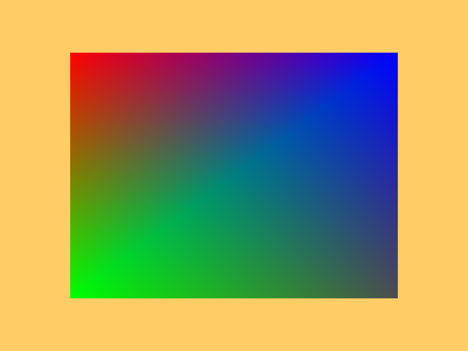

Tests transfers to VRAM using staging buffers.

### [Texture 2D](source/Test/05-Texture2D/)

Tests texture 2D load and display.

### [Uniform Buffers](source/Test/06-UniformBuffers/)

Tests the usage of uniform buffers.

### [Texture 1D](source/Test/07-Texture1D/)
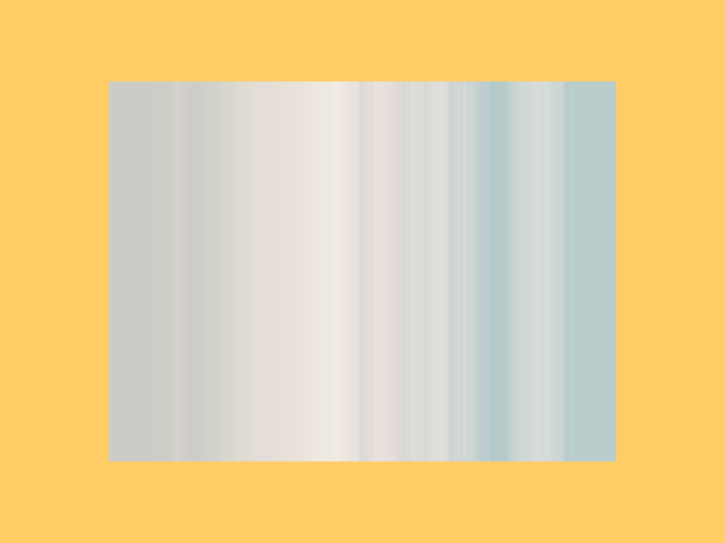

Tests texture 1D load and display.

### [Texture Buffer](source/Test/08-TextureBuffer/)
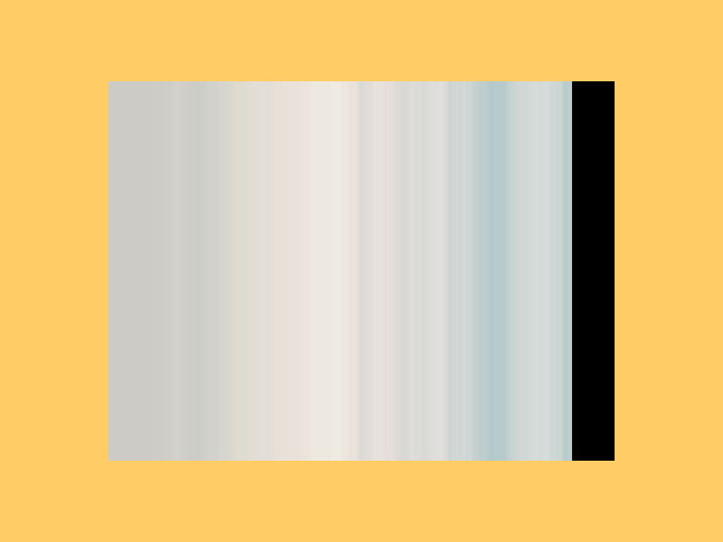

Tests texture buffer load and display.

### [Frame Buffer](source/Test/09-FrameBuffer/)

Tests frame buffers, and index buffers too.

### [Spinning cube](source/Test/10-SpinningCube/)
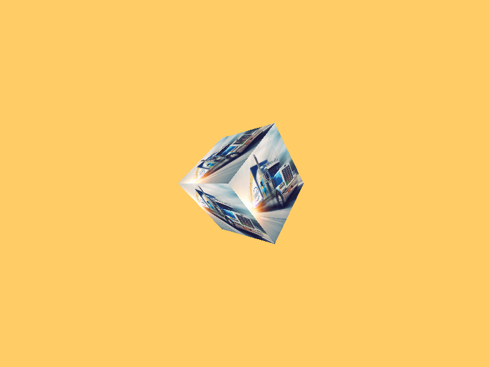

Tests depth buffer, depth test, and multiple uniform buffers.

### [Texture 3D](source/Test/11-Texture3D/)
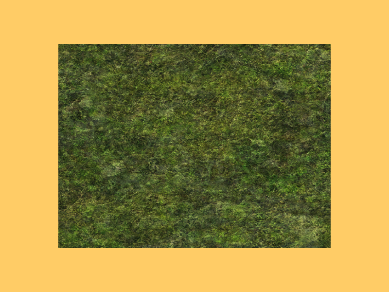

Demonstrates load and display of a 3D texture.

### [Texture Cube](source/Test/12-TextureCube/)
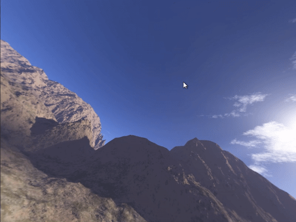

Loads a cube texture and displays it as a skybox.

### [Push Constants](source/Test/13-PushConstants/)
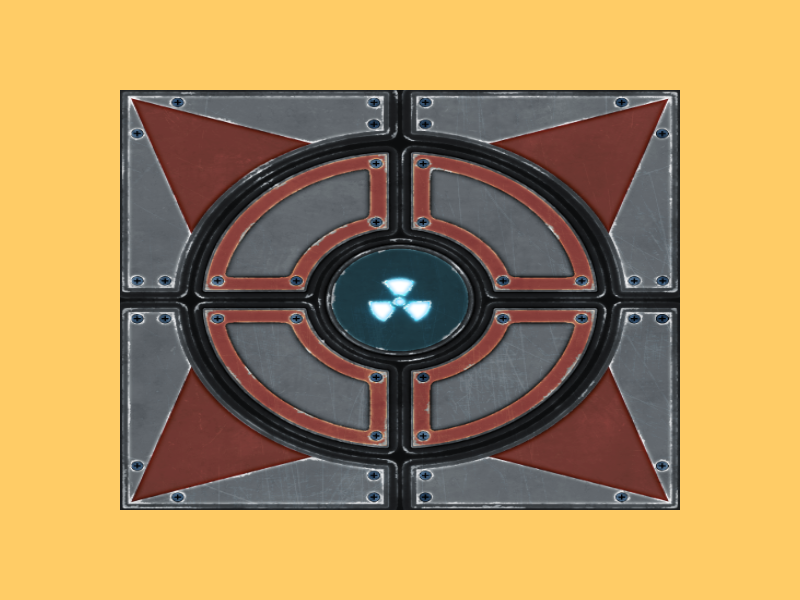

Demonstrates the use of push constants, by displaying two cubes with different colour modifiers, stored in push constants.

### [Render to Cube](source/Test/14-RenderToCube/)

Tests render to cube, by taking an equirectangular texture, and loading it into a skybox.

### [Instantiation](source/Test/15-Instantiation/)
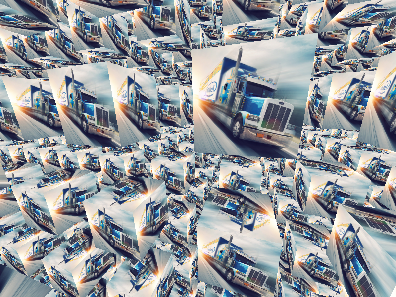

Tests hardware instantiation, by rendering 1'000'000 cubes.

### [Compute Pipeline](source/Test/16-ComputePipeline/)
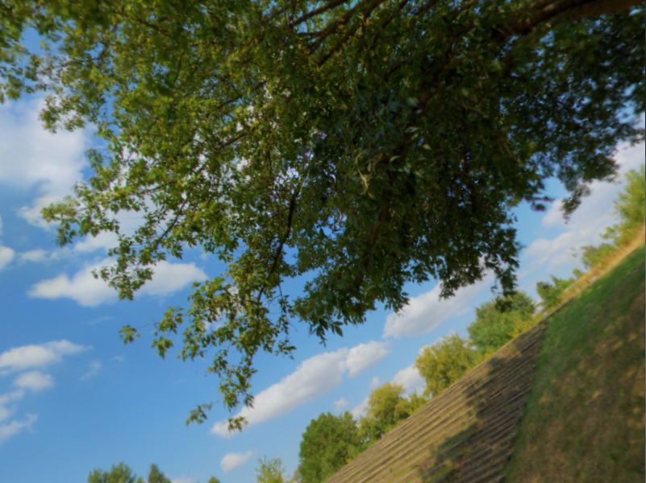

Tests Compute pipeline, by processing the output of the PushConstants sample to add a graphical effect.

### [Compressed Texture 2D](source/Test/17-CompressedTexture2D/)
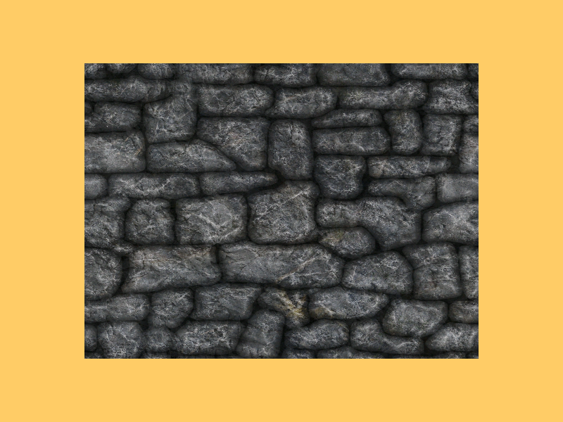

Tests loading a texture 2D, compressed in either BC3, ASTC 8x8 or ETC2, depending on support by the rendering API.

### [Texture 2D Mipmaps](source/Test/18-Texture2DMipmaps/)

Tests loading a texture 2D and its mipmap levels from a file.

### [Compressed Texture 2D Array](source/Test/19-CompressedTexture2DArray/)

Tests loading a texture 2D array, compressed in either BC3, ASTC 8x8 or ETC2, depending on support by the rendering API.

### [Dynamic Uniform Buffers](source/Test/20-DynamicUniformBuffer/)
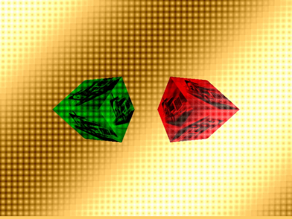

Takes the push constant test case and uses dynamic buffer descriptor instead of multiple descriptors.

### [Specialisation Constants](source/Test/21-SpecialisationConstants/)
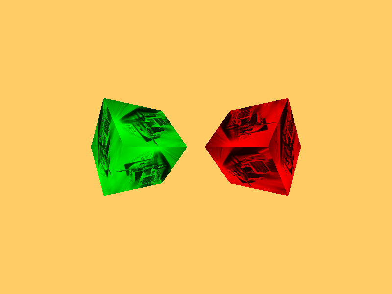

Tests the specialisation constants in Vulkan (matching them with uniforms in OpenGL renderers).

### [SPIR-V Specialisation Constants](source/Test/22-SPIRVSpecialisationConstants/)
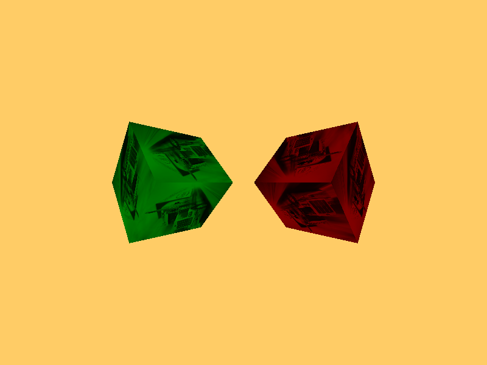

Tests the specialisation constants in Vulkan and OpenGL renderers (as long as they support SPIRV shaders).

### [Bloom](source/Test/23-Bloom/)
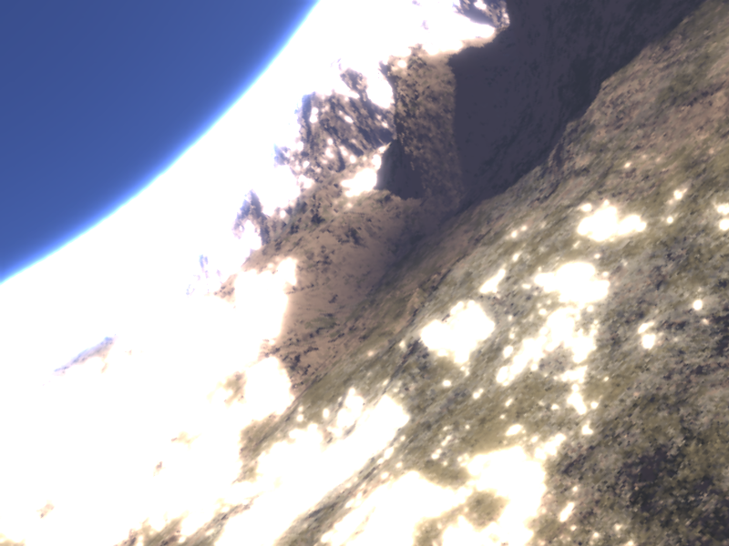

Bloom implementation using downscale through mipmaps.

## Sample applications

#### Sample apps to implement
- Compute particle system.

These applications use the library in a more complex way, closer to what would be done within an engine.

### [Object Loading](source/Samples/01-ObjectLoading/)
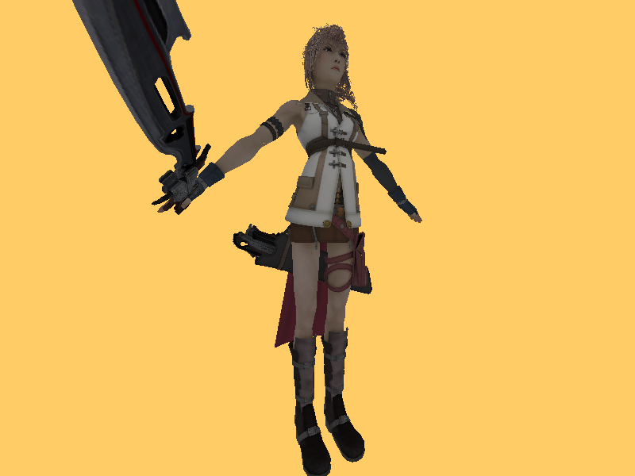

Loads an object, with textures, and displays it.

### [Lighting](source/Samples/02-Lighting/)
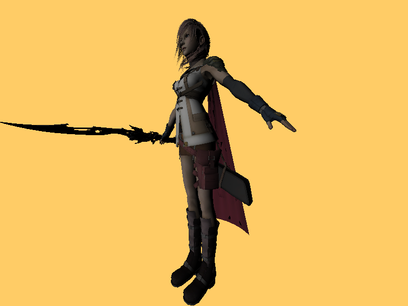

Applies lights to the previously loaded object.

### [Normal Mapping](source/Samples/03-NormalMapping/)
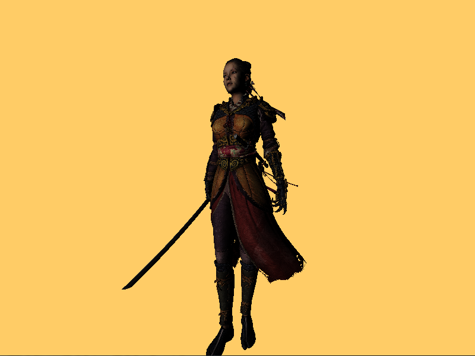

Applies normal mapping.

### [Deferred Rendering](source/Samples/04-DeferredRendering/)
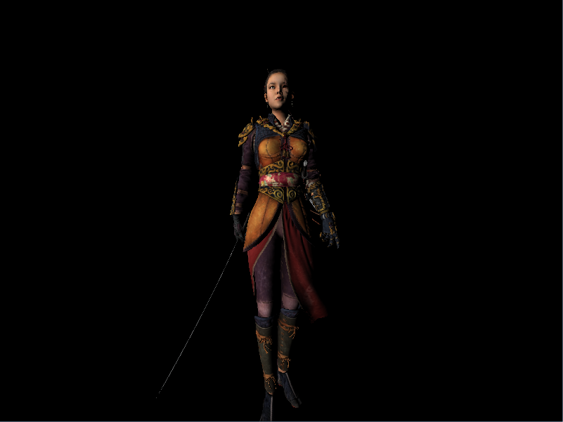

Deferred rendering implementation for opaque objects

### [Billboards](source/Samples/05-Billboards/)
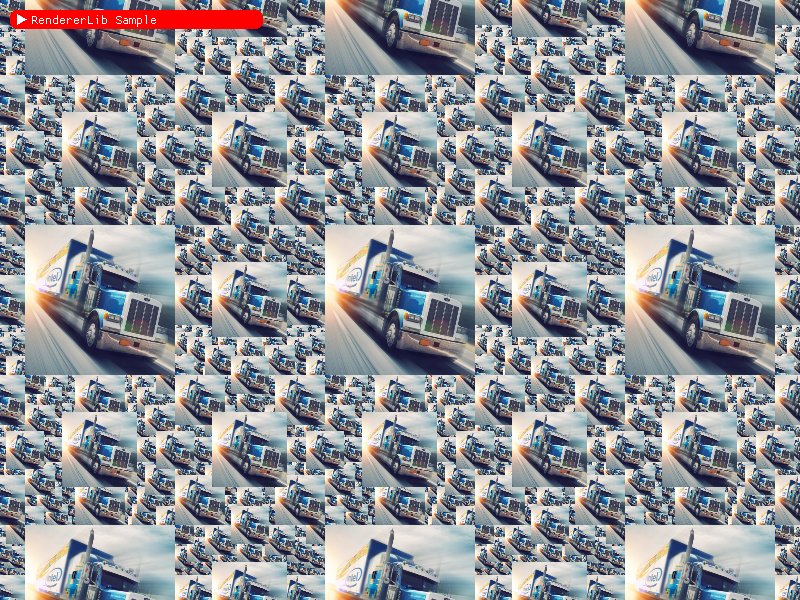

Billboards sample.
