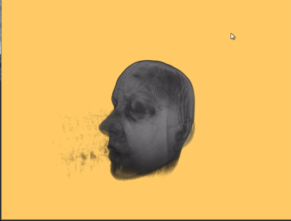

RendererLib
===========

RendererLib is a rendering library written in C++14, matching closely Vulkan interfaces.
Vulkan and OpenGL renderers are actually written.
It comes with a set of test applications, to validate the API.

It is a WIP, the library is really far from complete!!

## Test applications

### [Device creation](source/Test/01-DeviceCreation/)

Most basic example, initialises the logical device.

### [Swapchain creation](source/Test/02-SwapChainCreation/)

Another simple test, checking that swapchain creation succeeds.

### [Vertex layout](source/Test/03-VertexLayout/)

Tests vertex layouts, by displaying a coloured rectangle.

### [Staging buffer](source/Test/04-StagingBuffer/)

Tests transfers to VRAM using staging buffers.

### [Texture 2D](source/Test/05-Texture2D/)

Tests texture 2D load and display.

### [Uniform Buffers](source/Test/06-UniformBuffers/)

Tests the usage of uniform buffers.

### [Texture 1D](source/Test/07-Texture1D/)

Tests texture 1D load and display.

### [Texture Buffer](source/Test/08-TextureBuffer/)

Tests texture buffer load and display.

### [Frame Buffer](source/Test/09-FrameBuffer/)

Tests frame buffers, and index buffers too.

### [Spinning cube](source/Test/10-SpinningCube/)

Tests depth buffer, depth test, and multiple uniform buffers.

### [Texture 3D](source/Test/11-Texture3D/)

Demonstrates load and display of a 3D texture.

### [Texture Cube](source/Test/12-TextureCube/)

Loads a cube texture and displays it as a skybox.
